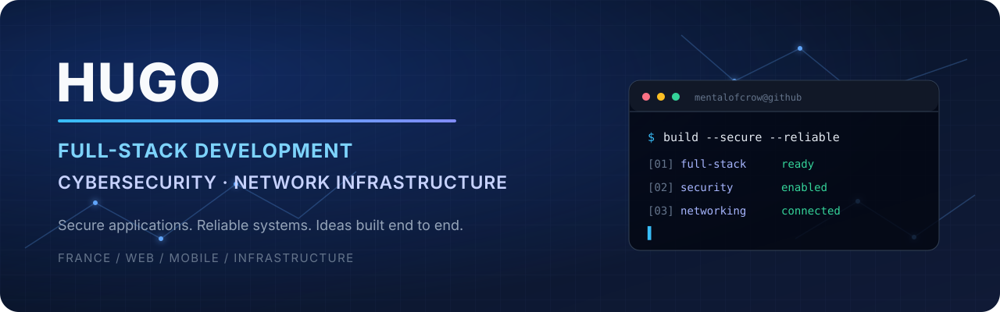

  

## About me

I'm **Hugo**, a French developer and an incoming fourth-year IT student focused on **full-stack development**, **cybersecurity**, and **network infrastructure**.

I build web and mobile applications from interface to deployment, with particular attention to clean architecture, performance, secure coding, and reliable infrastructure.

### Help me grow this portfolio ⭐

I’d genuinely value your feedback. Take a look at my developer portfolio and tell me what you think. If you enjoy it, starring the repository helps more people discover the project and brings me closer to GitHub’s **Starstruck** achievement.

  

- 🇫🇷 Based in France; French is my primary language.
- 🔐 Interested in application security, systems hardening, and security-by-design.
- 🐞 Practicing responsible bug bounty and vulnerability disclosure, primarily on **[YesWeHack](https://www.yeswehack.com/)** and **[Intigriti](https://www.intigriti.com/)**, with additional experience on [HackerOne](https://www.hackerone.com/) and [Bugcrowd](https://www.bugcrowd.com/).
- 🌐 Developing deeper expertise in Linux, networking, containers, and infrastructure.
- 📱 Building full-stack web platforms and cross-platform mobile applications.
- 🤝 Open to relevant collaborations when my availability and the project scope align.

## What I build

<table width="100%">
  <tr>
    <td width="33%" valign="top">
      <h3>🌐 Web platforms</h3>
      Full-stack applications built from the user interface to APIs, databases, deployment, and monitoring.
    </td>
    <td width="33%" valign="top">
      <h3>📱 Mobile applications</h3>
      Cross-platform mobile experiences with Flutter, Dart, and React Native, backed by reliable services.
    </td>
    <td width="33%" valign="top">
      <h3>🛡️ Secure infrastructure</h3>
      Linux, networking, containers, observability, and security practices integrated throughout the project lifecycle.
    </td>
  </tr>
</table>

## Projects

I currently work across **38 repositories: 14 public and 24 private**. Much of my active work remains private, particularly mobile applications, websites, team projects, and repositories containing personal or confidential material. I keep a curated selection public to share experiments, technical explorations, and selected projects.

If a private project interests you, [contact me](https://hugobisserier.com/contact). When confidentiality and ownership allow it, I can share a demonstration, selected code excerpts, architecture decisions, or a technical walkthrough so we can compare approaches and improve together.

## Technologies

Each card opens an official tutorial or documentation page.

### Frontend &amp; web

<table width="100%">
  <tr>
    <td align="center" width="200"><a href="https://developer.mozilla.org/en-US/docs/Learn_web_development/Core/Structuring_content"> <strong>HTML5</strong></a></td>
    <td align="center" width="200"><a href="https://developer.mozilla.org/en-US/docs/Learn_web_development/Core/Styling_basics"> <strong>CSS3</strong></a></td>
    <td align="center" width="200"><a href="https://developer.mozilla.org/en-US/docs/Learn_web_development/Core/Scripting"> <strong>JavaScript</strong></a></td>
    <td align="center" width="200"><a href="https://react.dev/learn"> <strong>React</strong></a></td>
  </tr>
  <tr>
    <td align="center" width="200"><a href="https://vuejs.org/tutorial/"> <strong>Vue.js</strong></a></td>
    <td align="center" width="200"><a href="https://threejs.org/manual/en/creating-a-scene.html"> <strong>Three.js</strong></a></td>
    <td align="center" width="200"><a href="https://angular.dev/tutorials"> <strong>Angular</strong></a></td>
    <td align="center" width="200"><a href="https://ejs.co/#docs"> <strong>EJS</strong></a></td>
  </tr>
</table>

### Backend, languages &amp; scripting

<table width="100%">
  <tr>
    <td align="center" width="270"><a href="https://nodejs.org/en/learn/getting-started/introduction-to-nodejs"> <strong>Node.js</strong></a></td>
    <td align="center" width="270"><a href="https://www.php.net/manual/en/getting-started.php"> <strong>PHP</strong></a></td>
    <td align="center" width="270"><a href="https://docs.python.org/3/tutorial/"> <strong>Python</strong></a></td>
  </tr>
  <tr>
    <td align="center" width="270"><a href="https://dev.java/learn/"> <strong>Java</strong></a></td>
    <td align="center" width="270"><a href="https://go.dev/learn/"> <strong>Go / Golang</strong></a></td>
    <td align="center" width="270"><a href="https://learn.microsoft.com/en-us/dotnet/csharp/tour-of-csharp/overview"> <strong>C#</strong></a></td>
  </tr>
  <tr>
    <td align="center" width="270"><a href="https://learn.microsoft.com/en-us/dotnet/core/get-started"> <strong>.NET</strong></a></td>
    <td align="center" width="270"><a href="https://ubuntu.com/tutorials/command-line-for-beginners"> <strong>Shell / Bash</strong></a></td>
    <td align="center" width="270"><a href="https://learn.microsoft.com/en-us/powershell/scripting/learn/ps101/00-introduction"> <strong>PowerShell</strong></a></td>
  </tr>
</table>

### Mobile, cross-platform &amp; real-time 3D

<table width="100%">
  <tr>
    <td align="center" width="200"><a href="https://docs.flutter.dev/get-started"> <strong>Flutter</strong></a></td>
    <td align="center" width="200"><a href="https://dart.dev/tutorials"> <strong>Dart</strong></a></td>
    <td align="center" width="200"><a href="https://reactnative.dev/docs/getting-started"> <strong>React Native</strong></a></td>
    <td align="center" width="200"><a href="https://learn.unity.com/"> <strong>Unity</strong></a></td>
  </tr>
</table>

### Data &amp; backend services

<table width="100%">
  <tr>
    <td align="center" width="270"><a href="https://supabase.com/docs/guides/getting-started"> <strong>Supabase</strong></a></td>
    <td align="center" width="270"><a href="https://dev.mysql.com/doc/refman/8.4/en/tutorial.html"> <strong>MySQL</strong></a></td>
    <td align="center" width="270"><a href="https://mariadb.com/docs/server/mariadb-quickstart-guides/basics-guide"> <strong>MariaDB</strong></a></td>
  </tr>
  <tr>
    <td align="center" width="270"><a href="https://www.postgresql.org/docs/current/tutorial.html"> <strong>PostgreSQL</strong></a></td>
    <td align="center" width="270"><a href="https://neo4j.com/docs/getting-started/cypher/"> <strong>Neo4j / Cypher</strong></a></td>
    <td align="center" width="270"><a href="https://mqtt.org/getting-started/"> <strong>MQTT</strong></a></td>
  </tr>
</table>

### Infrastructure, security &amp; delivery

<table width="100%">
  <tr>
    <td align="center" width="200"><a href="https://www.kali.org/docs/introduction/what-is-kali-linux/"> <strong>Kali Linux</strong></a></td>
    <td align="center" width="200"><a href="https://docs.docker.com/get-started/"> <strong>Docker</strong></a></td>
    <td align="center" width="200"><a href="https://git-scm.com/doc"> <strong>Git</strong></a></td>
    <td align="center" width="200"><a href="https://docs.github.com/en/desktop/overview/getting-started-with-github-desktop"> <strong>GitHub Desktop</strong></a></td>
  </tr>
  <tr>
    <td align="center" width="200"><a href="https://grafana.com/tutorials/grafana-fundamentals/"> <strong>Grafana</strong></a></td>
    <td align="center" width="200"><a href="https://techdocs.broadcom.com/us/en/vmware-cis/desktop-hypervisors/workstation-pro/17-0.html"> <strong>VMware Workstation</strong></a></td>
    <td align="center" width="200"><a href="https://docs.exegol.com/first-install"> <strong>Exegol</strong></a></td>
    <td align="center" width="200"><a href="https://docs.github.com/en/actions/about-github-actions/understanding-github-actions"> <strong>GitHub Actions</strong> CI/CD</a></td>
  </tr>
</table>

## Let's build something

Have a useful idea, a technical challenge, or a collaboration proposal? Send me a friend request on Discord with a short introduction and a few details about the project.

  

**Discord username:** `ramenmakidaki`

If I am available and the project is a good fit, let's turn the idea into something real.
